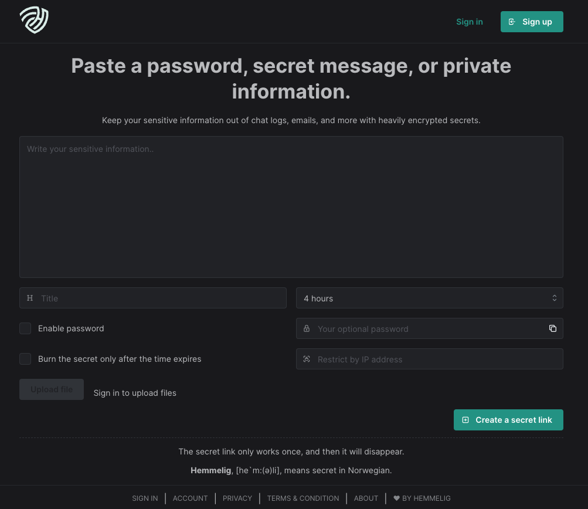

<div align="center">
  
</div>

<h1 align="center">Free encrypted secret sharing for everyone!</h1>

<div align="center">
  This application is to be used to share encrypted secrets cross organizations, or as private persons. Hemmelig truly cares about your privacy, and will do everything to stay that way. I hope you enjoy the product.
</div>

## SaaS

Hemmelig is available at [https://hemmelig.app](https://hemmelig.app)



## How it works

You enter [https://hemmelig.app](https://hemmelig.app), write your sensitive information, expire time, optional password, and click create a secret link. You share the secret link. The receiver of the link opens it, writes the optional password, and retrieves the sensitive information.
When a secret link is created, it gets its unique encryption key that is not saved to the database and only will be part of the URL. This is how the encryption works: `encrypt(DATA, YOUR_UNIQUE_ENCRYPTION_KEY)`. The encryption of the text and files is done in the client; this means the server will get the encrypted information, and nothing in clear text.

## Features

-   Client side encryption
-   Encrypted sensitive information sharing
-   Encrypted file upload for signed in users
-   Secret lifetime
-   Set max views per secret
-   Optional encryptet title
-   Optional password protection
-   Optional IP address restriction
-   Encrypted key is part of the URL, and not saved to the database for an extra layer of security
-   It will detect if the secret is base64 encoded, and add a button to convert it to plain text on read
-   Self-hosted version. Keywords: Regulatory compliance

## Docker image

-   hemmeligapp/hemmelig:bleeding-edge (pushed on every commit to main)
-   hemmeligapp/hemmelig:weekly (pushed every week on Friday)
-   hemmeligapp/hemmelig:v3.4.0 (see the github tags)
-   hemmeligapp/hemmelig:latest (pushed on releases)

## Self-hosting

If you have to follow some sort of compliance, and have to self-host, [https://hemmelig.app](https://hemmelig.app) is available as a docker image. The following is the bare minimum to run the docker image.

```bash
# To use this image you need a redis database enabled.
# Example:
#
# $ docker run -p 6379:6379 --name some-redis -d redis
#

docker run -p 3000:3000 -d --name=hemmelig \
    -e SECRET_REDIS_HOST=127.0.0.1 \
    -v /var/tmp/hemmelig:/var/tmp/hemmelig/upload/files # this is how you mount a local directory if you choose to use disk upload, and not do/s3
    hemmeligapp/hemmelig:latest
```

Have a look at the Dockerfile for a full example of how to run this application.

## Environment variables

-   `SECRET_LOCAL_HOSTNAME` Default: 0.0.0.0. - The local hostname for the fastify instance
-   `SECRET_PORT` Default: 3000. - The port number for the fastify instance
-   `SECRET_HOST` Default: "". - Used for i.e. set cors to your domain name
-   `SECRET_REDIS_HOST` Default: 0.0.0.0 - Override this for your redis host adress
-   `SECRET_REDIS_PORT` Default: 6379 - The redis port number
-   `SECRET_REDIS_TLS` Default: false - If the redis instance is using tls
-   `SECRET_REDIS_USER` Default: "" - You redis user name
-   `SECRET_REDIS_PASSWORD` Default: "" - Your redis password
-   `SECRET_MAX_TEXT_SIZE` Default: "256" - The max text size for the secret. Is set in kb. i.e. 256 for 256kb.
-   `SECRET_JWT_SECRET` Default: good_luck_have_fun - Override this for the secret signin JWT tokens for log in
-   `SECRET_FILE_SIZE` Default: 4 - Set the total allowed upload file size in mb.
-   `SECRET_ENABLE_FILE_UPLOAD` Default: true - Enable or disable file upload
-   `SECRET_DO_SPACES_ENDPOINT` Default: "" - The Spaces/s3 endpoint
-   `SECRET_DO_SPACES_KEY` Default: "" - The Spaces/s3 key
-   `SECRET_DO_SPACES_SECRET` Default: "" - The Spaces/s3 secret
-   `SECRET_DO_SPACES_BUCKET` Default: "" - The Spaces/s3 bucket name
-   `SECRET_DO_SPACES_FOLDER` Default: "" - The Spaces/s3 folder for uploading
-   `SECRET_USER_DISABLE` Default: false - Disable user registration

## Run locally

```bash
$ npm install

# Start the frontend
$ npm run client-dev
# http://0.0.0.0:8080

# Start the backend
$ npm run server-dev
# http://0.0.0.0:3000
```

## Contribution

Feel free to contribute to this repository. Have a look at CONTRIBUTION.md for guidelines.
